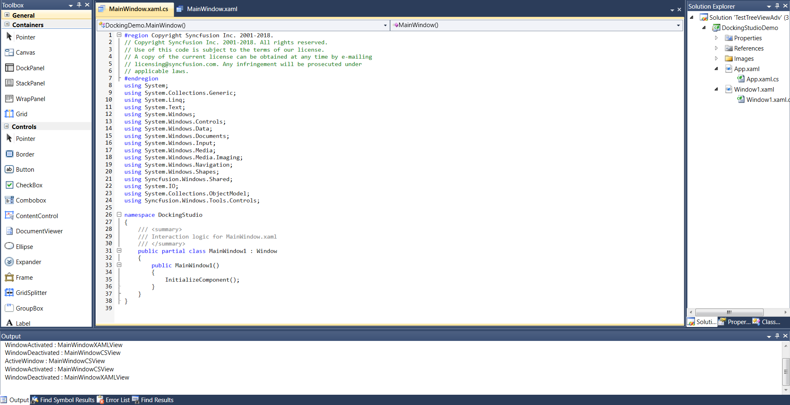

# Visual Studio-like Docking Windows Demo for WPF
As .NET developers, we have all worked in Visual Studio and at some point may have wondered about the docking windows that hold the Solution Explorer, Code Window, Toolbox, and others. Visual Studio-style docking windows allow you to resize, move, and change the behavior of windows to create a layout that suits various development models. The Syncfusion docking manager allows users to create their own layouts by just dragging and dropping windows to the desired positions. Users can persist the layout with built-in serialization options. Every part of the docking windows can be customized, and a variety of built-in themes are included for changing the window appearance.

## Overview
The docking manager component lets you add Visual Studio-style docking windows and tabbed document interfaces to your application. It allows the interactive dragging of docking windows around the screen to make them float over any location. As in Visual Studio, the docking manager offers different kinds of windows:

* Dock
* Float
* Document
* Autohidden

For more details please click [VisualStudio like DockingManager](https://www.syncfusion.com/blogs/post/create-visual-studio-like-docking-windows-in-wpf.aspx)

